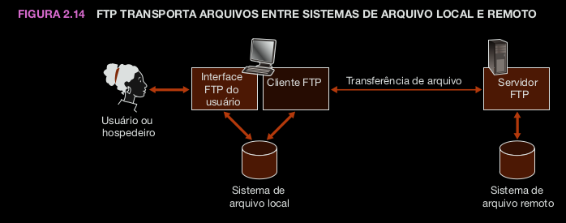

# ***Princípios de Aplicações de Rede***
---

## *Arquiteturas de aplicação de rede*

## *Comunicação entre processos*

## *Serviços de transporte disponíveis para aplicações*

## *Serviços de transporte providos pela internet*

## *Protocolos de camada de aplicação*

## *Apicações de rede abordadas neste livro*

# *A Web e o HTTP*
---

## *Descrição geral do HTTP*

## *Conexões persistentes e não persistentes*

## *Formato da mensagem HTTP*

## *Interação usuário-servidor: cookies*

## *Caches Web*

## *GET condicional*

# *Transferência de arquivos FTP*
---
* ***FTP***: File Transfer Protocol
* Em uma sessão típica FTP, o usuário quer transferir arquivos entre um hospedeiro local e um servidor remoto. Para acessar a conta remota, o usuário fornece uma identificação e uma senha, que após autorizado pelo servidor, pode fazer a transferência (download ou upload)



* Como mostra a imagem, o usuário interage com o FTP através de um agente de usuário FTP. Primeio, ele fornece o nome do hospedeiro remoto, que faz com que o processo cliente FTP do hospedeiro local estabeleça uma conexão TCP com o processo servidor FTP do hospedeiro remoto. O usuário então fornece sua identificação e senha, que são  enviadas pela conexão TCP como parte dos comandos FTP. Assim que autorizado pelo servidor, o usuário copia um ou mais arquivos armazenados no sistema de arquivo local para o sistema de arquivo remoto (ou vice-versa).
* Tanto o HTTP quanto o FTP utilizam o TCP
* FTP usa duas conexões paralelas TCP (ao contrário do HTTP, que utiliza apenas 1): uma **conexão de controle** e uma **conexão de dados**
* **Conexão de controle**: envia informações de controle (identificação, senha, comandos de troca de diretório, comados de *put* e *get*)
* **Conexão de dados**: é a que de fato envia os arquivos
  


* Como o FTP usa uma conexão de controle separada, dizemos que ele envia suas informações de controle **fora da banda**.
* Quando é iniciada uma sessão FTP, o lado do usuário inicia uma conexão TCP de **controle** com o lado do servidor na porta número 21 e envia por ela os comandos
* Quando o lado do servidor recebe um comando *put* ou *get*, o servidor abre uma conexão de **dados** para o lado do cliente na porta 20 para transferir os arquivos. O FTP envia exatamente 1 arquivo pela conexão e logo em seguida o fecha.
* Logo, com o FTP, a conexão de controle fica aberta durante toda a sessão do usuário, mas a de dados é criada e fechada para cada arquivo transferido na sessão
* Durante a sessão, o FTP deve manter informações de estado sobre o usuário (diretório corrente, conta do usuário, ...), o que limita o número de sessões simultâneas

## *Comandos e respostas FTP*

```bash 
USER username
#usado para enviar identificação do usuário ao servidor
PASS password
#usado para enviar a senha do usuário ao servidor
LIST
#usado para pedir ao servidor que envie uma lista com todos os arquivos existentes no atual diretório remoto. A lista de arquivos é enviada por meio de uma conexão de dados (nova e não persistente),e não pela conexão TCP de controle.
RETR filename
#usado para extrair (isto é, obter) um arquivo do diretório atual do hospedeiro remoto. Ativa o hospedeiro remoto para que abra uma conexão de dados e envia o arquivo requisitado por essa conexão.
STOR filename
#usado para armazenar (isto é, inserir) um arquivo no diretório atual do hospedeiro remoto.
```

* Há, em particular, uma correspondência direta entre o comando que o usuário gera e o comando FTP enviado pela conexão de controle. Cada comando é seguido de uma resposta, que é enviada do servidor ao cliente.
* As respostas são números de três dígitos com uma mensagem opcional após o número. Elas se assemelham, em estrutura, ao código de estado e à frase da linha de estado da mensagem de resposta HTTP.
  
Exemplo:   
`331 Nome de usuário OK, senha requisitada`

# *Correio eletrônico na Internet*
---

## *SMTP*

## *Comparação com o HTTP*

## *Formatos de mensagem de correio*

## *Protocolos de acesso ao correio*

# *DNS: o serviço de diretório da Internet*
---

## *Serviços fornecidos pelo DNS*

## *Visão geral do modo de funcionamento do DNS*

## *Registros e mensagens DNS*

# *Aplicações P2P*
---
