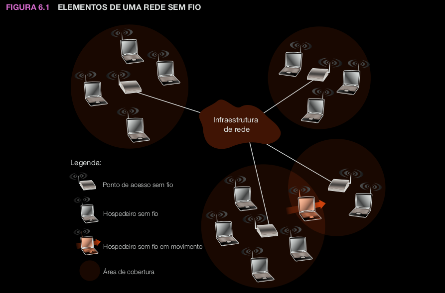

# *Introdução*
---

* *Hospedeiros sem fio*: Equipamentos de sistema finais que executam aplicações. Podem ser moveis ou não.
* *Enlaces sem fio*: É a "ponte" entre o hospedeiro sem fio e uma estação-base ou outro hospedeiro sem fio. Dependendo de sua tecnologia, podem ter taxas de transmissão diversas e distâncias variadas. Enlaces sem fio conectam hospedeiros localizados na borda da rede com a infraestrutura da rede de maior porte. Porém, eles também podem ser utilizados dentro de uma rede.
* *Estação-base*: É responsável pelo envio e recebimento de dados (por exemplo, pacotes) de um hospedeiro sem fio ligado a ela. Quando se fala que um hospedeiro está "associado" ou "ligado", isso quer dizer que o hospeideiro está dentro do alcance de comunicação se fio da estação-base e o hospedeiro usa a estação-base para retransmitir dados entre ele (o hospedeiro) e a rede maior. **Torres celulares** em redes celulares e **pontos de acesso em LANs sem fio 802.11** são exemplos. Na figura, a estação-base está conectada à rede maior (internet), portanto ela é uma retransmissora da camada de enlace entre o hospedeiro sem fio e o resto do mundo com o qual o hospedeiro se comunica. 

# *Características de enlaces e redes sem fio*
---

## *CDMA*

# *Wi-Fi: LANs sem fio 802.11*
---

## *A arquitetura 802.11*

## *O protocolo MAC 802.11*

## *O quadro IEEE 802.11*

## *Mobilidade na mesma sub-rede IP*

## *Recursos avançados em 802.11*

## *Redes pessoais: Bluetooth e Zigbee*

# *Acesso celular à internet*
---

## *Visão geral da arquitetura de rede celular*

## *Redes de dados celulares 3G*

## *No caminho pro 4G: LTE*

# *Gerenciamento da mobilidade: princípios*
---

## *Endereçamento*

## *Roteamento para um nó móvel*

# *IP Móvel*
---

# *Gerenciamento de mobilidade em redes celulares*
---

## *Roteando chamadas para um usuário móvel*

## *Transferências (handoffs) em GSM*

# *Redes sem fio e mobilidade*
---

# *Resumo*
---