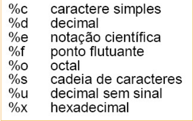

# *Applets*
---

# *Gráficos, Fontes/Textos e cores*
---

# *Java Web Start*
---

# *Anotações*
---

# *Streams de Entrada e Saída*
---
* Toda operação de entrada e saída de uma aplicação Java faz uso de um obejto que identifica um fluxo (stream) de informações
* Um stream é uma sequência de dados transmitidos de uma fonte de entrada para uma fonte de entrada para um destino de saída e vice-versa
* Um **Stream de Entrada** é utilizado para ler os dados a partir de uma fonte, um item de cada vez. Um **Steam de Saída** é utilizado para gravar dados para um destino, um item por vez.
* **InputStream** e **OutputStream** são as classes abstratas definidas no pacote java.io que representam um **Stream de entrada** e um **Stream de saída**, respectivamente 
* Os principais stream definidos no Java são:
  * Byte Stream
  * Character Stream
  * Buffered Stream
  * Data Stream
  * Object Stream

## *Byte Stream*
* É um tipo de fluxo utilizado para realizar a operação E/S de bytes
* As classes **FileInputStream** e **FileOutputStream** representam este tipo de fluxo
  
```java
FileInputStream in = null;
FileOutputStream out = null;
try {
    in = new FileInputStream("fe.txt");
    out = new FileOutputStrem("fs.txt");
    int c;
    while ((c = in.read()) != -1)
        out.write(c);
}
```
## *Character Stream*
* A plataforma Java armazena os caracteres utilizando a notação Unicode. Um Character Stream automaticamente converte o formato utilizado para o formato local, facilitando a internacionalização da aplicação
* Todas as classes de Character Stream são descendentes de **Reader** e **Writer**

```java
FileReader in = null;
FileWriter out = null;
try {
    in = new FileReader("fe.txt");
    out = new FileWriter("fs.txt");
    int c;
    while ((c = in.read()) != -1)
        out.write(c);
}
```
## *Buffered Stream*
* Os fluxos vistos até então não fazem uso de uma memória auxiliar (buffer) para armazenar o que está sendo enviado/recebido
* O java implemente este tipo de fluxo para oferecer este tipo de operação
  
```java
BufferedReader in = new BufferedReader(new InputStreamReader(System.in));
String monitor = "";
System.out.println("Digite algo");
try {
    monitor = teclado.readLine();
}
System.out.println("foi digitado:"+monitor);
```
## *Data Stream*
* É um tipo de fluxo que oferece suporte ao envio/recebimento de tipos de dados (boolean, char, byte, short, int, long, float, e double), bem como de Strings também
* Todos os Data Stream implementam a interface **DataInput** ou **DataOutput**
```java
static final double[] precos ={19,9,15};
static final int[] unidades ={12,8,13};
static final String[] descs ={"TS","pin","boné"};

out = new DataOutputStream(new BufferedOutputStream(new FileOutputStream("fs.txt")));

for (int i = 0; i < precos.length; i ++) {
    out.writeDouble(precos[i]);
    out.writeInt(unidades[i]);
    out.writeUTF(descs[i]);
}
```
## *Object Stream*
* É um tipo de fluxo que oferece suporte ao envio/recebimento de Objetos, cuja classe implemente a interface *Serializable*
* As clases Object Stream são **ObjectInputStream** e **ObjectOutputStream**
```java
Object ob = new Object();
//escrita
out.writeObject(ob);

//leitura
Object ob2 = in.readObject();
```
## *Exercícios*
1. Escrever a classe StreamApp que leia uma arquivo texto (dados.txt) e informe na tela o número de caracteres totais existentes nesse arquivo.
2. Na classe StreamApp, criar um método para contar o número de vezes
que um determinado caracter (por exemplo ‘a’), informado pelo usuário em
tempo de execução, aparece no arquivo texto (dados.txt).

<details>
<summary>Resposta 1</summary>

```java

```
</details>

<details>
<summary>Resposta 2</summary>

```java

```
</details>

# *Entrada e Saída de Dados com as classes Scanner e Formatter*
---
## *Classes Scanner e Formatter*
* A classe **Scanner** implementa as operações de entrada de dados pelo teclado
* A classe **Formatter** implementa as operações de saída dos dados gerados pela aplicação

```java
Formatter fmt = new Formatter(System.out);
Scanner scn = new Scanner(System.in);

int n1 = scn.nextInt();
fmt.format("n1: %d", n1);
```
* O método principal (format) é muito similar à função `printf(...)` da linguagem C:
```java
fmt.format(String fmt, Object ... args); 
``` 

* Os principais caracteres de formatação estão apresentados abaixo:



* Para cada um dos tipos primitivos, há um método **nextXxx()** correspondente

```java
int n = ler.nextInt();
float preco = ler.nextFloat();
double salario = ler.nextDouble();
String palavra = ler.next();
```

*Tanto a classe Scanner como a Formatter pretencem ao pacote java.util.
* A classe Scanner divide substrings (tokens) qualquer dado entrado. Estes são separados por delimitadores
* Se a string não puder ser interpretada com o tipo especificado, a exceção **InputMismatchException** é anunciada
* Há também um conjunto de métodos **hasNextXxx()**, como por exemplo **hasNextInt()**, que retornam verdadeiro ou falso, de acordo com o tipo de token passado
* A classe Formatter fornece vários construtores, cada qual com um tipo de parâmetro específico

```java
Formatter(File file)
Formatter(OutputStream os)
Formatter(String fileName)
Formatter(PrintStream ps)
```
## *Classes Path e Files*
* O pacote **java.nio.file** fornece a classe Path para manipular o caminho em um determinado sistema de arquivos

```java
// Sintaxe Microsoft Windows
Path path = Paths.get("C:\\home");
```

* Também fornece a classe Files composta por vários métodos para manipulação de arquivos, tais como: criação, cópia e exclusão de arquivos
  
```java
Files.createFile(file);
Files.delete(path);
Files.copy(source, target, REPLACE_EXISTING);
Files.move(source, target, REPLACE_EXISTING);
Files.createDirectory(path);
```
## *Exercícios*
1. Escrever a classe ScannerApp que leia quatro notas, calcule a sua média aritmética e imprima na tela o seu resultado com duas casas decimais.
2. Escrever a classe ScannerAppv2 que leia o arquivo numeros.txt (8.532767 3.14159 1000000.1) e calcule a soma dos seus valores, imprimindo o resultado na tela.
3. Escrever a classe BackupApp que realiza o backup de todos os arquivos .java existentes no pacote unidade2. 

<details>
<summary>Resposta 1</summary>

```java

```
</details>

<details>
<summary>Resposta 2</summary>

```java

```
</details>

<details>
<summary>Resposta 3</summary>

```java

```
</details>

# *Resumo*
---