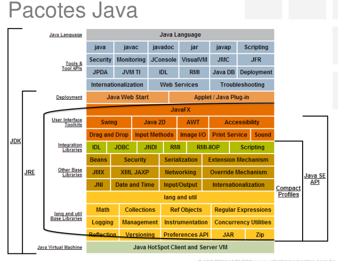

# *Pacotes Java*
---

## *O conceito de pacotes*
* Um pacote é: um conjunto de classes e interfaces relacionadas e outros pacotes que provê **acesso protegido** e **gerenciamento de espaço de nomes (namespaces)**


## *Acesso Protegido*
* Os pacotes são organizados em diretórios
* Há um mecanismo de controle de acesso (package) às classes e interfaces de um determinado pacote
* Somente as classes e interfaces de um mesmo pacote podem acessar uns aos outros de forma irrestrita, porém restrigindo o acesso a outros tipos de pacotes

## *Gerenciamento de Espaço de Nomes*
* Para que os nomes de seus tipos não entrem em conflito com os nomes de tipos de outros pacotes, cada qual cria o seu prório espaço de nomes (namespaces)
  
`java.lang.Object e org.omg.CORRA.Object`



* O Java 8 define mais de 200 pacotes para serem utilizados no desenvolvimento de aplicativos Java

### *Principais pacotes Java*
```java
java.lang: //classes e interfaces fundamentais – importado automaticamente
java.applet: //classes e interfaces para a criação de applets na Internet
java.util: //classes e interfaces utilitárias
java.io: //classes e interfaces para entrada e saída
java.nio: //classes e interfaces para buffers
java.net: //classes e interfaces para uso em rede (TCP/IP)
java.rmi: //classes e interfaces para acesso remoto
java.sql: //classes e interfaces para acesso ao Banco de Dados
java.awt: //interface gráfica universal nativa
java.text: //internacionalização, transformação e formatação de texto
java.time: //classes para datas e calendários
javax.crypto: //classes e interfaces para operações de criptografia
javax.xml: //classes e interfaces para manipulação de XML
```
* O nome dos pacotes são hierárquicos e separados por pontos
* Convecionalmente, os elementos dos nomes de pacotes estão normalmente em letras minúsculas
* Para indicar que as classes de um arquivo pertencem a um determinado pacote, utiliza-se a palavra reservada **package**
* A declaração de pacote, se houver, deve estar sempre no inicío do arquivo de origem
* Hierarquias de pacotes são construídas através de hierarquias de diretório
* Para se criar uma classe como pertencente a um pacote, deve-se:
  * Declará-la em um arquivo dentro do diretório que representa o pacote
  * Declarar, na primeira linha, que a classe pertence ao pacote, usando-se a palavra reservada

# *Importação de Pacotes Java*
---
* Com o coringa "*" é possível importar todas as classes/interfaces que estão definidas em um pacote, **exceto os seus subpacotes**
* Importar todas as classes