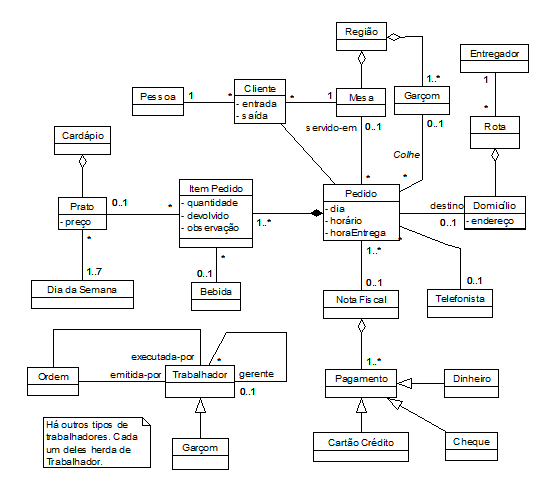

# Relatório sobre o Diagrama de Classes da UML

## Introdução
O Diagrama de Classes da UML (Unified Modeling Language) é uma ferramenta gráfica utilizada para representar a estrutura estática de um sistema orientado a objetos. Ele descreve as classes do sistema, seus atributos, métodos e os relacionamentos entre elas.

## Componentes do Diagrama de Classes
O Diagrama de Classes é composto por diversos elementos, que são:

### Classe
Uma classe é a representação de um conceito ou entidade do sistema. Ela possui um nome e pode conter atributos e métodos. As classes são representadas por retângulos no diagrama.

### Atributo
Um atributo é uma característica ou propriedade de uma classe. Ele descreve o estado da classe e é representado por um nome e um tipo de dado. Os atributos são representados dentro do retângulo da classe.

### Método
Um método é uma operação ou comportamento que uma classe pode realizar. Ele define as ações que a classe pode executar e é representado por um nome, parâmetros e um tipo de retorno. Os métodos são representados dentro do retângulo da classe.

### Relacionamento
O relacionamento representa a associação entre duas ou mais classes. Existem diferentes tipos de relacionamentos, como:

- Associação: representa uma relação entre duas classes, indicando que uma classe utiliza ou depende da outra.
- Agregação: representa uma relação de todo-parte entre duas classes, indicando que uma classe é composta por outras classes.
- Composição: é um tipo especial de agregação em que uma classe é composta por outras classes e a existência das partes depende da existência do todo.
- Herança: representa uma relação de especialização entre duas classes, indicando que uma classe herda os atributos e métodos de outra classe.
- Interface: representa um contrato que uma classe deve implementar, definindo os métodos que a classe deve ter.

### Cardinalidade
A cardinalidade define a quantidade de instâncias de uma classe que podem se relacionar com instâncias de outra classe. Ela é representada por números ou símbolos, como:

- 1: indica que uma instância da classe pode se relacionar com apenas uma instância da outra classe.
- 0..1: indica que uma instância da classe pode se relacionar com no máximo uma instância da outra classe.
- 0..*: indica que uma instância da classe pode se relacionar com várias instâncias da outra classe.
- 1..*: indica que uma instância da classe deve se relacionar com pelo menos uma instância da outra classe.

## Conclusão
O Diagrama de Classes da UML é uma ferramenta poderosa para modelar a estrutura de um sistema orientado a objetos. Ele permite visualizar as classes, seus atributos, métodos e os relacionamentos entre elas, facilitando o entendimento e a comunicação entre os membros da equipe de desenvolvimento.

# Estudo de Caso

## Diagrama de classes UML

## Explicação